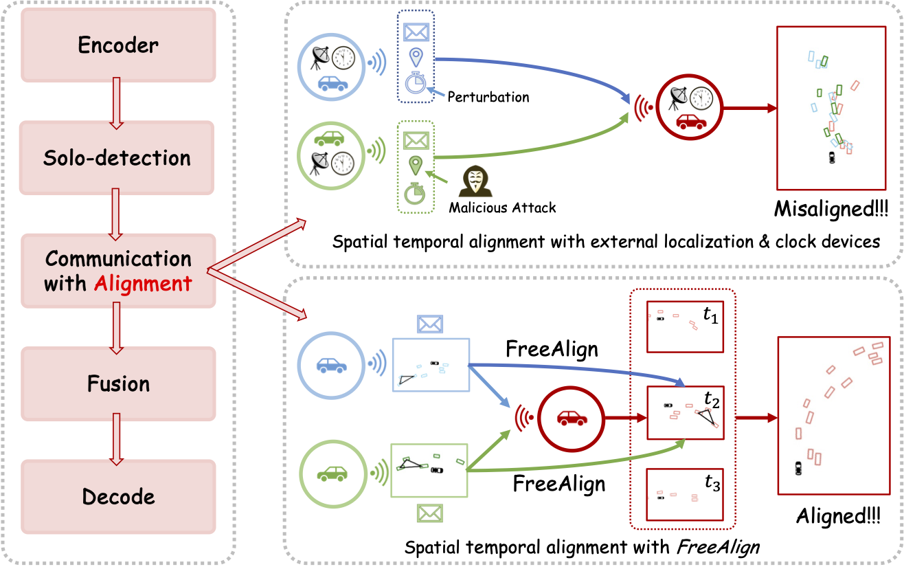

# FreeAlign (ICRA2024)

Robust Collaborative Perception without External Localization and Clock Devices



[Paper](https://arxiv.org/pdf/2405.02965)


## Installation

I recommend you visit [Installation Guide](https://udtkdfu8mk.feishu.cn/docx/LlMpdu3pNoCS94xxhjMcOWIynie) to learn how to install this repo. Our code repository is based on the CoAlign Environment.

Or you can refer to [OpenCOOD data introduction](https://opencood.readthedocs.io/en/latest/md_files/data_intro.html)
and [OpenCOOD installation](https://opencood.readthedocs.io/en/latest/md_files/installation.html) guide to prepare
data and install the envirnment. The installation is totally the same as OpenCOOD.

The api of camera collaboration and the implementation Lift-Splat will be released in March. OPV2V, V2XSet and DAIR-V2X are supported. Pay attention to the repo if you need.

> Note that I update the AP calculation (sorted by confidence) and add data augmentations (reinitialize) in this codebase, so the result will be higher than that reported in the current paper. I retrain all the models and would update the paper to the final version before March. Then I will remove this paragraph.


## Complemented Annotations for DAIR-V2X-C
Originally DAIR-V2X only annotates 3D boxes within the range of camera's view in vehicle-side. We supplement the missing 3D box annotations to enable the 360 degree detection. With fully complemented vehicle-side labels, we regenerate the cooperative labels for users, which follow the original cooperative label format.


**Download:** [Google Drive](https://drive.google.com/file/d/13g3APNeHBVjPcF-nTuUoNOSGyTzdfnUK/view?usp=sharing)

**Website:** [Website](https://siheng-chen.github.io/dataset/dair-v2x-c-complemented/)

# Running Guidance
**Download:** [Baidu Drive](https://pan.baidu.com/s/16JvC7aVTuobUUL99l6NmQA?pwd=5j6c)
Down load the logs folder with your checkpoint and run inference with
```
python opencood/tools/inference.py --model_dir $CKPT_PATH
```
You can modify the config.yaml in the CKPT_PATH to see the performance gap between our method and previous methods. The key parameters include "gt_correct"(enable freealign) and noise_setting.


## Acknowlege

This project is impossible without the code of [CoAlign](https://github.com/yifanlu0227/CoAlign), [OpenCOOD](https://github.com/DerrickXuNu/OpenCOOD), [g2opy](https://github.com/uoip/g2opy) and [d3d](https://github.com/cmpute/d3d)!
